# Project description

This project contains interactive scene created for Decentraland Game Jam 2023 based on the theme 'Lucid Dreams'. It is written using Decentraland SDK version 7. All of the code and models have been created during the contest period. Scene doesn't connect to external servers.

Currently deployed under Decentraland name `LucidDreams`. Follow [this link](https://play.decentraland.org/?realm=LucidDreams.dcl.eth) or type in the Decentraland chatbox `/changerealm LucidDreams.dcl.eth` to visit the scene.

Experience consists of three levels, each with a mini-game that needs to be completed in order to move on to the next level. There are no instructions in-game as I tried to create the experience self-explanatory. I usually don't read instructions myself and quickly click through dialogs when talking with NPCs.

#### Level 1 - Nightmare

User needs to correctly guess 5 words by playing word guessing game 'Hangman'. Word selection for this game is stored in this repository.
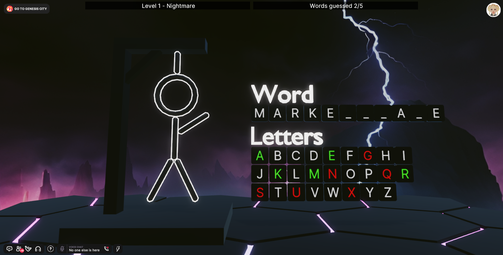

#### Level 2 - Lost in dream

User needs to find exit to maze by opening doors with levers.
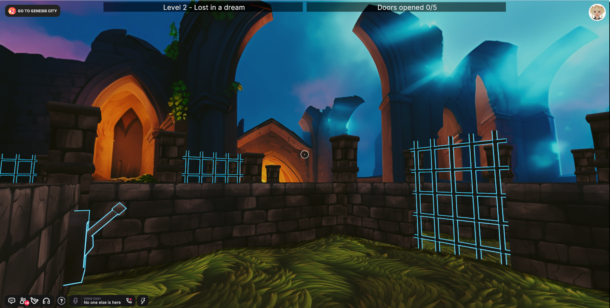

#### Level 3 - Sweet dream

User needs to complete 10 rounds of reaction game by stepping on the tile with correct color and symbol before time runs out.
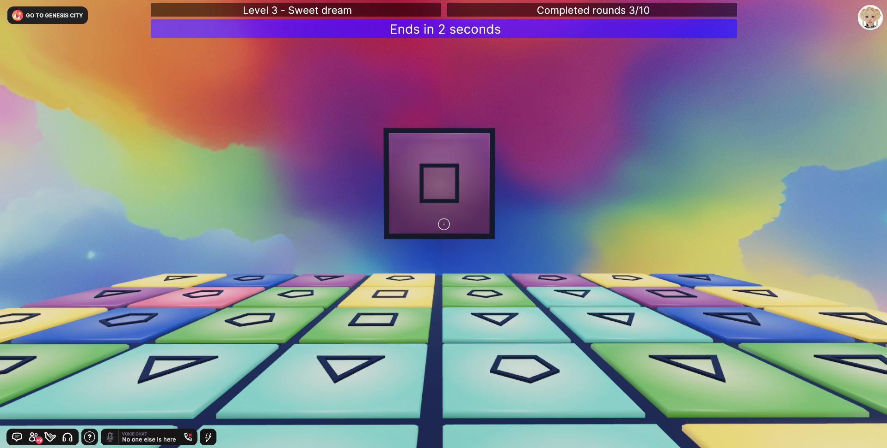

## Use of AI

#### Blockade Labs Skybox AI Tool

Skybox for each level generated using [Blockade Labs Skybox AI Tool](https://skybox.blockadelabs.com/) licensed under the [CC BY 4.0 license](https://creativecommons.org/licenses/by/4.0/)

- First level [skybox](https://skybox.blockadelabs.com/c969b36096aa7556ec4c58293257422e)
  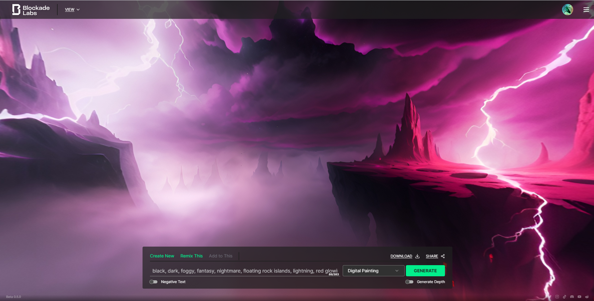

- Second level [skybox](https://skybox.blockadelabs.com/31344ff34f0fa14a7c30093f0abc740f)
  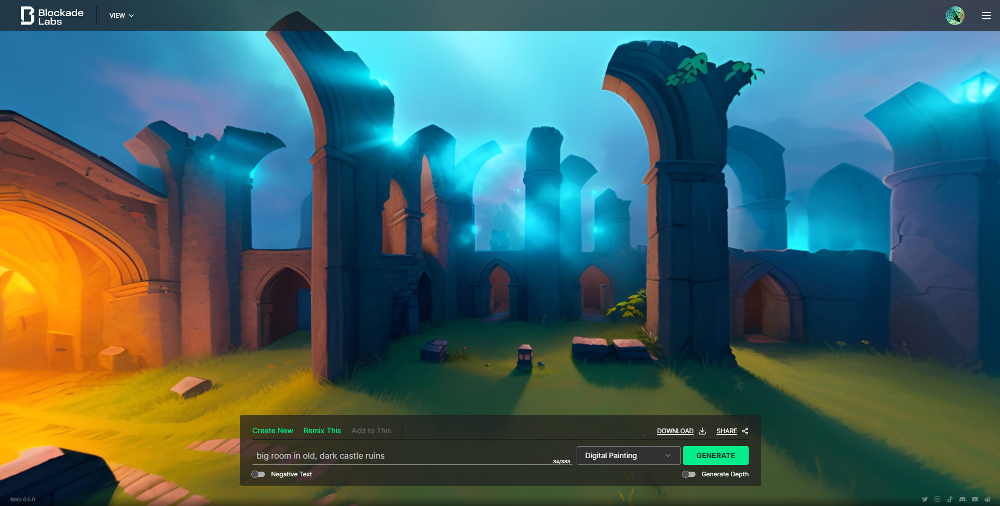

- Third level [skybox](https://skybox.blockadelabs.com/36833a73d3793e69c6d7e5cdc8b85663)
  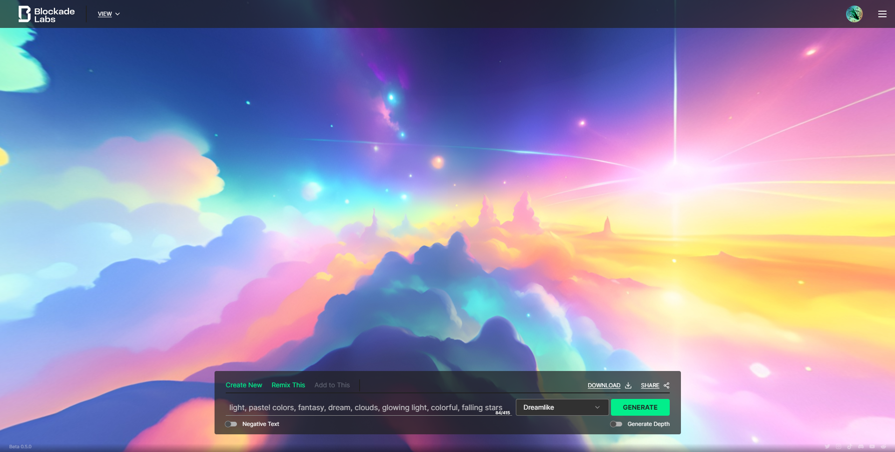

#### Midjourney

Textures for second level maze generated using [Midjourney](https://www.midjourney.com/)

- Bricks - bottom right image
  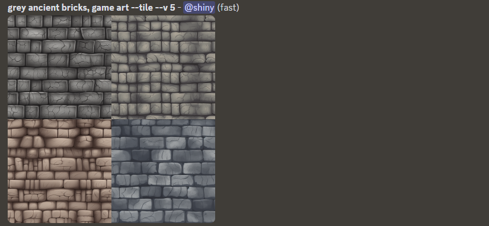

- Grass - top left image
  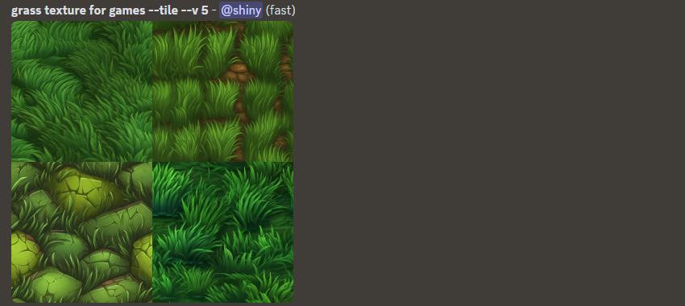

#### ChatGPT

Advice and code fragments from my colleague [ChatGPT](https://chat.openai.com/)

- Helping me with a base code for the color game
  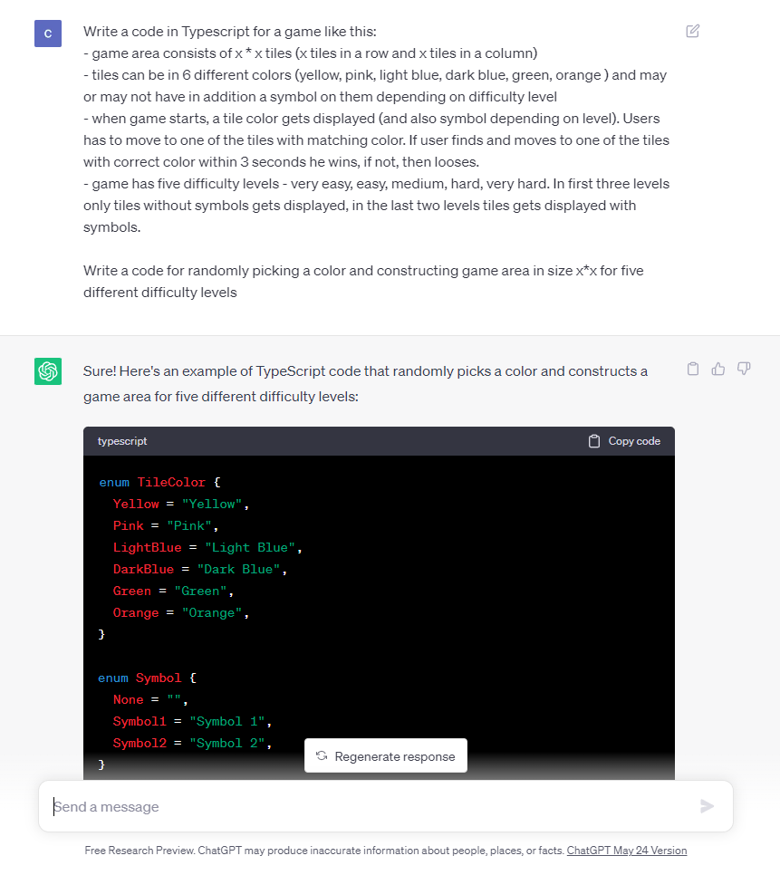

- Giving me some ideas for mini-games
  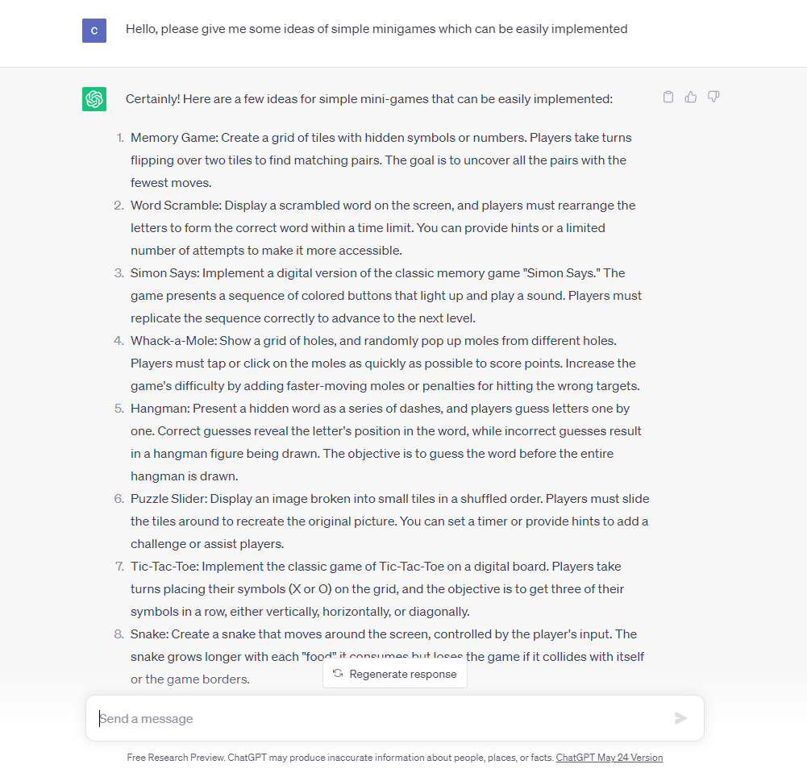

- Helping me come up with words for 'Hangman' game
  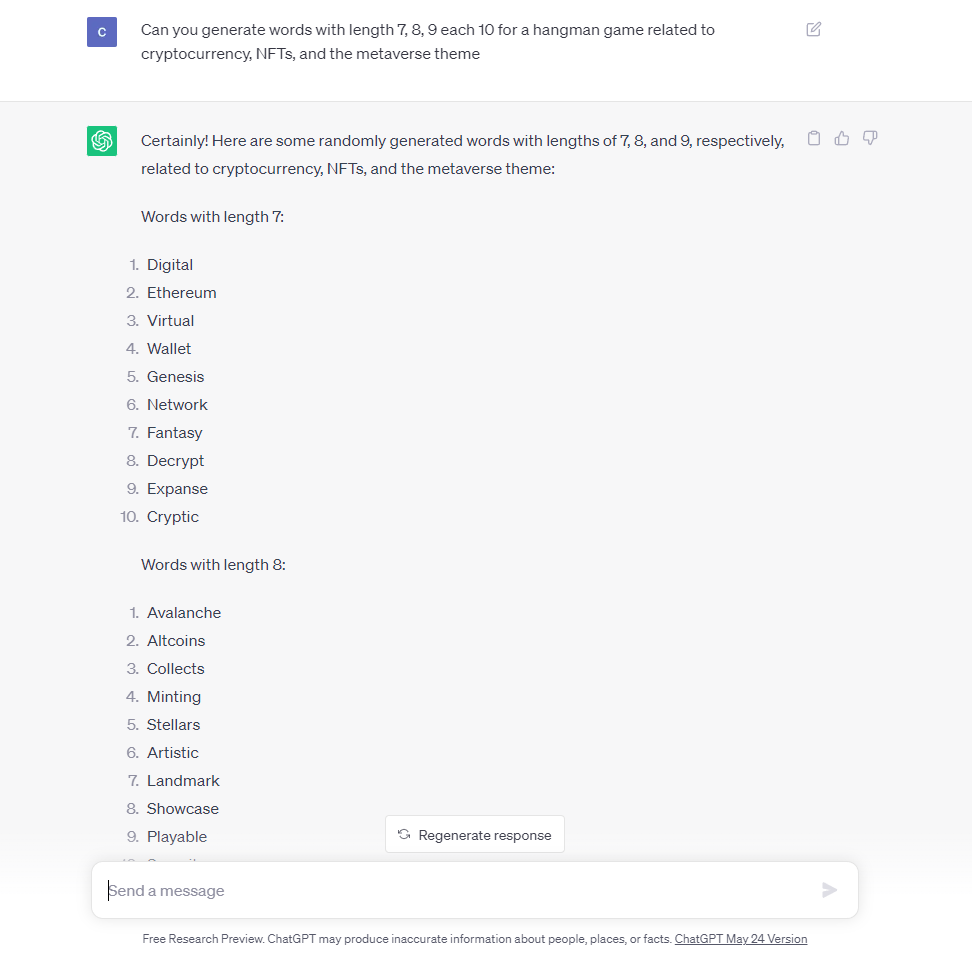

## Try it out

1. Download this repository.

2. Install the [Decentraland Editor](https://docs.decentraland.org/creator/development-guide/sdk7/editor/)

3. Open a Visual Studio Code window on this scene's root folder. Not on the root folder of the whole repo, but instead on this sub-folder that belongs to the scene.

4. Open the Decentraland Editor tab, and press **Run Scene**

Alternatively, you can use the command line. Inside this scene root directory run:

```
npm i
npm run start
```

## Copyright info

This scene is protected with a standard Apache 2 licence. See the terms and conditions in the [LICENSE](/LICENSE) file.
